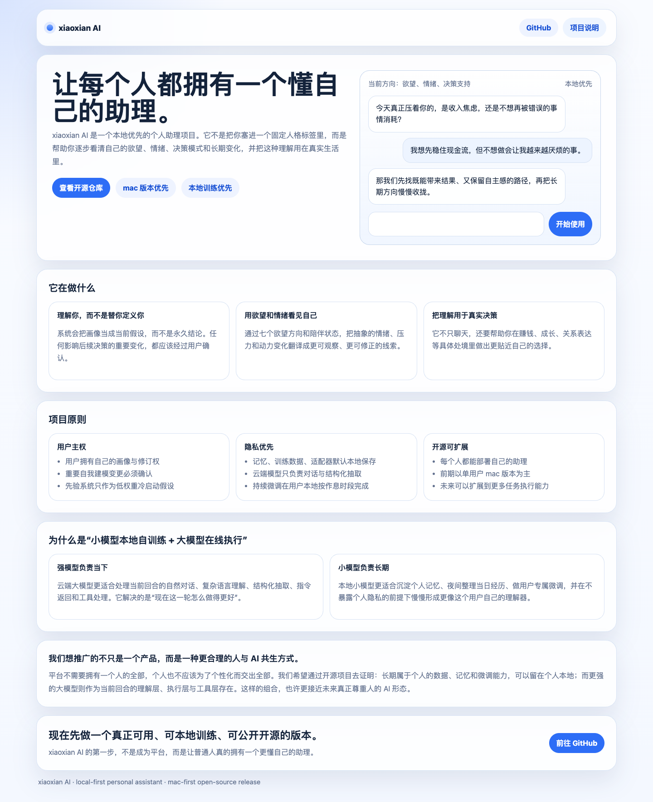

# xiaoxian AI

让每个人都拥有一个懂自己的助理。

`xiaoxian AI` 是一个本地优先的个人助理项目。它希望帮助每个人逐步建立对自己欲望、情绪、决策模式与长期变化的清晰理解，并把这种理解真正用在现实生活里。

这个仓库当前聚焦于：

- macOS 与 Windows 都能运行的本地应用
- 本地记忆与本地持续训练
- 云端大模型负责对话、指令返回和工具处理
- 本地小模型负责回复前的个性化提示、长期整理、夜间微调和隐私保护
- Agent Reach 提供 Exa 搜索、公开网页读取和 GitHub 仓库检索

当前平台支持边界：

| 能力 | macOS Apple Silicon | Windows 10/11 |
| --- | --- | --- |
| Web 应用、对话、记忆和日志 | 支持 | 支持 |
| 云端兼容模型 | 支持 | 支持 |
| Ollama 本地对话 | 支持 | 支持 |
| VibeThinker + MLX 本地微调 | 已验证 | 尚未验证，默认关闭 |

## 项目截图




## 我们为什么做这个项目

今天的大模型已经很强，但“真正理解某一个具体的人”依然是个没有被很好解决的问题。

平台型产品很难做到真正个性化，因为：

- 每个人不会愿意把自己完整交给平台
- 人的变化需要时间标记、确认机制和可回溯修订
- 长期个体数据越多，越需要私密、持续、低成本的整理与训练方式

`xiaoxian AI` 想尝试一种更合理的人与 AI 共生方式：

1. 强模型负责当前回合的理解与执行
2. 小模型负责本地长期自我建模与微调
3. 用户始终拥有自己的画像主权、记忆修订权和隐私边界

## 核心理念

### 1. 用户主权高于平台定义

系统的任务不是替用户定义“你是谁”，而是帮助用户更清楚地看见自己。

- 画像应该可检查
- 画像应该可修正
- 画像应该带时间和证据
- 重要变化必须经过用户确认

### 2. 先验只能是低权重假设

MBTI、八字、紫微、星盘、易经等内容，在这里不作为命运判断工具，而只作为冷启动时帮助理解性格倾向的低权重假设。

它们可以帮助系统更早问出更好的问题，但不能替代长期真实对话和现实行为证据。

### 3. 欲望与情绪不是噪音，而是理解用户的入口

项目当前会把“七个欲望方向”作为一种可视化镜头，帮助用户观察自己当前更偏向：

- 正向发展
- 接近平衡
- 阴影拉扯

它不是诊断，也不是打标签，而是帮助用户更快识别：

- 我现在真正被什么驱动
- 我在什么地方失衡了
- 我该如何做出更贴近自己的选择

## 为什么采用“小模型本地自训练 + 大模型在线执行”

这是 `xiaoxian AI` 最重要的技术主张之一。

### 大模型适合做什么

大模型更适合：

- 当前回合的自然对话
- 更强的语言理解与总结
- 指令返回
- 结构化记忆抽取
- 工具调用与任务处理
- 需要新鲜外部信息时，第一次模型调用提出联网请求，工具执行后由第二次模型调用生成带来源回答

### 小模型适合做什么

小模型更适合：

- 在云端大模型回复前提取与当前问题有关的个性化提示
- 在本地长期持有用户自己的训练素材
- 夜间或休息时段持续微调
- 对每天完整经历进行整理与归档
- 在不泄露隐私的前提下慢慢形成“更像你自己的模型”

本地个性化模型使用轻量常驻进程：活跃对话期间复用已经加载的模型和适配器，空闲 10 分钟后自动休眠。每一轮仍显式传入当前消息和自我模型摘要，不在进程内偷偷积累不可检查的用户画像。

### 为什么这种组合更合理

因为它兼顾了三件事：

1. **能力**  
   在线大模型保证即时响应与强推理能力。

2. **隐私**  
   用户自己的长期记忆、画像修订、训练样本和适配器尽量留在本地。

3. **持续个性化**  
   小模型不需要在每次对话里都变得最聪明，但它可以越来越像“你自己的那一份理解器”。

这也是我们认为更适合未来的一种 AI 形态：

不是所有东西都被平台收走，也不是所有事情都靠一个超级云端模型完成，而是让每个人都逐步拥有属于自己的 AI 资产与 AI 伙伴。

## 当前版本在做什么

- 实时聊天与结构化候选记忆抽取
- 高影响画像变更的确认机制
- 七个欲望方向展示
- 陪伴状态展示
- 本地认知日志与夜间微调流程
- 休息时间窗口内的自动训练调度
- 本地个性化模型常驻、健康检查、崩溃重启与适配器切换
- 新适配器激活前的本地冒烟验证与失败回滚
- 个性化赚钱建议与通用 AI 基线的同题对照评估
- 对话内的外部赚钱动作授权队列：发布、联系、购买、开户和转账必须先授权，并在工具返回匹配证据后才能标记完成
- 带来源的互联网搜索和公开网页读取；私人画像、记忆和凭据不会进入搜索词
- 本地赚钱实验账本：预测收入、实验过程指标与有收款凭证的已核验收入分别记录
- 低权重先验技能整合
- 独立项目介绍页

## 仓库结构

- `apps/web`：本地 Web 应用
- `packages/agent-runtime`：对话运行时与结构化输出处理
- `packages/memory-core`：记忆、确认、投影、聊天历史
- `packages/training-data`：训练样本生成与自我模型摘要
- `packages/local-model-finetune`：本地微调流程
- `packages/prior-engines`：先验技能与统一翻译层
- `site/landing`：项目介绍页
- `docs/setup`：macOS 与 Windows 安装指南
- `ops/caddy`：站点部署草案

## 隐私与开源边界

这个仓库是公开开源仓库，但**个人数据不属于公开代码的一部分**。

不要提交以下内容：

- `data/`
- `apps/web/data/`
- 本地聊天记录
- 用户画像快照
- 本地训练数据
- 训练输出 adapter / checkpoint
- 本地 API key / base URL 配置

赚钱任务中的研究、比较和草稿可以由 Agent 主动完成；发布内容、联系他人、购买、开户、转账等外部动作必须先获得用户明确授权。预计收入不等于真实收入，咨询量等过程指标也不改变收入；系统只有在本地账本收到 `payment_record` 收款凭证后，才会增加已核验收入。

## 本地开发

```bash
npm install
npm run dev
```

默认本地访问：

```text
http://127.0.0.1:4173
```

更完整、可逐步复制的安装说明：

- [macOS 安装说明](docs/setup/macos-local-install.md)
- [Windows 安装说明](docs/setup/windows-local-install.md)
- [互联网工具安装说明](docs/setup/internet-tools.md)

Windows 最短启动路径：

```powershell
git clone https://github.com/dentes9988/xiaoxian-ai.git
cd xiaoxian-ai
npm run setup:windows
npm run check:windows
npm run dev
```

如果你想启用本地小模型训练，仓库默认推荐：

- `mlx-community/VibeThinker-3B-4bit`

原因很简单：它已经是当前项目默认训练基座模型，适合 Apple Silicon + MLX 路线，体积和本地可用性也更平衡。Windows 当前可以运行应用，但这条训练路径尚未完成实机验证，因此不会假装已经具备训练平台等价性。

## 验证

```bash
npm test
npm run typecheck
npm run check:internet
```

## English Summary

`xiaoxian AI` is a local-first personal assistant project focused on helping each person build an inspectable, correctable, privacy-preserving self-model.

The core architectural idea is:

- a stronger online model handles live conversation, instruction return, memory extraction, and tool use
- a smaller local model handles long-term organization, local fine-tuning, and private user-specific adaptation

During an active conversation, a resident local personalization worker prepares turn-specific hints before the stronger model replies. It sleeps after ten idle minutes, and nightly local training is scheduled inside the configured rest window. The application runs on macOS and Windows; the VibeThinker + MLX training path is currently verified only on Apple Silicon.

External earning actions remain approval-gated. Projected revenue, experiment outcomes, and evidence-backed revenue are stored separately; only a `payment_record` increases verified revenue.

We believe this is a more sustainable human-AI symbiosis pattern: strong shared intelligence for execution, private local intelligence for personal continuity.

## License

MIT
